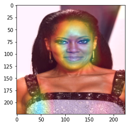

# blacbox

Making CNNs interpretable. Well because accuracy is not the best anymore

## Summary of Contents
<details open="open">
  <ol>
    <li>
      <a href="#about-the-project">About The Project</a>
      <ul>
        <li><a href="#built-with">Built With</a></li>
      </ul>
    </li>
    <li><a href="#new">New!</a></li>
    <li><a href="#coming-up">Coming up</a></li>
    <li>
      <a href="#getting-started">Getting Started</a>
      <ul>
        <li><a href="#prerequisites">Prerequisites</a></li>
        <li><a href="#installation">Installation</a></li>
      </ul>
    </li>
    <li><a href="#usage">Usage</a></li>
    <li><a href="#example">Example</a></li>
    <li><a href="#roadmap">Roadmap</a></li>
    <li><a href="#contributing">Contributing</a></li>
    <li><a href="#license">License</a></li>
    <li><a href="#contact">Contact</a></li>
   
  </ol>
</details>

<!-- ABOUT THE PROJECT -->
## About The Project
Consider a scenario where a military commander wants to identify enemy tanks and he uses an object-detetection algorithm. So based on some data he reports an accuracy of 99%. Naturally he would be happy(enemies definetely wouldn't). But when he puts this algorithm to use he fails terribly. Turns out the data used had images of tanks only at night but not during day so instead of learning about the tank the algorithm learned to distinguish day from night. He would have lost but thanks to blacbox he uses our techniques to save his day! 


### Built With
* [OpenCV](https://opencv.org/)
* [PyTorch](https://pytorch.org/)
* [Numpy, Pandas](https://pandas.pydata.org/)

## New!
- The project is fresh so the whole thing is new right now:p

## Coming up
- Improved version of Grad-CAM (Score-CAM, Grad-CAM++)
- A relatively new method just for object-detection algorithms. The DRISE method! (Paper: https://arxiv.org/abs/2006.03204)
- Added support for Image-Captioning and VQA models

<!-- GETTING STARTED -->
## Getting Started

### Prerequisites
- Python versions 3.6-3.10

### Installation
1. Install the latest version from github
```
pip install git+https://github.com/lazyCodes7/blacbox.git
```
2. Install from testPyPi(Working towards a stable version to release on PyPi)
```
pip install -i https://test.pypi.org/simple/ blacbox==0.1.0
```
## Usage
### 1. Saliency Maps
A saliency map is a way to measure the spatial support of a particular class in each image. It is the oldest and most frequently used explanation method for interpreting the predictions of convolutional neural networks. The saliency map is built using gradients of the output over the input.
Paper link: https://arxiv.org/abs/1911.11293

```python

from blacbox import Saliency
import matplotlib.pyplot as plt
import torchvison.models as models
# Load a model
model = models.resnet50(pretrained = True)

# Pass the model to Saliency generator
maps = Saliency(
  model, 
  device = 'cuda'
)

# Images.shape = (B,C,H,W), class_idx = used to specify the class to calculate gradients against
# saliencie return_type = np.ndarray(B,H,W,C)
saliencie = maps.reveal(
  images = images, 
  class_idx = "keepmax"
)

```
### Input image


### Output saliency


### 2. Guided Backpropagation
Guided backpropagation is an interesting variation of vanilla backprop where we zero out the negative gradients during backprop instead of transferring because of the fact that we are only interested in the positive influences.
Paper link: https://arxiv.org/abs/1412.6806

```python
from blacbox import GuidedBackPropagation
from blacbox import RaceClassifier
import torchvison.models as models

clf = RaceClassifier()

## Provide batch of images
images = torch.stack((image1, image2), axis = 0)

## Notice we are providing clf.model, the reason being clf itself that we used isn't of type nn.Module
gbp = GuidedBackPropagation(
  model = clf.model,
  device = device
)

## Provide batch
grads = gbp.reveal(
  images = images
)

## Provide path
grads = gbp.reveal(
  path = 'blacbox/architectures/images/dog.png'
)
```
### Inputs


### Outputs


### 3. Grad-CAM
Grad-CAM is another interesting way of visualizing the activation maps based on the gradients of a target and provides a coarse heatmap based on that.
Paper link: https://arxiv.org/abs/1610.02391

```python
from blacbox import RaceClassifier
from blacbox import GradCAM

## Initalize
clf = RaceClassifier()
## Provide batch of images
images = torch.stack((image1, image2), axis = 0)

## For interpolation refer to torch.interpolate methods
gcam = GCAM(
    model = clf.model,
    interpolate = 'bilinear',
    device = 'cuda'
)

## Generating the heatmaps
heatmaps = gcam.reveal(
  images = images, 
  module = clf.model.layer4[0].conv1,
  class_idx = 'keepmax',
  colormap = 'hot'
 )

# module: refers to the module to compute gradients and fmaps
# colormap: type of colormap to apply use gcam.colormap_dict to see valid types

## Overlay on images
ret_images = gcam.overlay(
  images = images,
  heatmaps = heatmaps,
  is_np = True
)
# is_np: To convert images to numpy for concat

```
### Input


### Heatmaps


### Overlay


### Note:
For using raceclassifier please download the pretrained_model [here](https://github.com/lazyCodes7/blacbox/tree/main/blacbox/pretrained_models) and provide it as a path
```python
from blacbox import RaceClassifier
clf = RaceClassifier(model_path = "<your path here>")
```

## Example
View the example notebook on colab

<!-- ROADMAP -->
## Roadmap

See the [open issues](https://github.com/lazyCodes7/blacbox/issues) for a list of proposed features (and known issues).


<!-- CONTRIBUTING -->
## Contributing

Contributions are what make the open source community such an amazing place to be learn, inspire, and create. Any contributions you make are **greatly appreciated**.

1. Fork the Project
2. Create your Feature Branch (`git checkout -b feature/AmazingFeature`)
3. Commit your Changes (`git commit -m 'Add some AmazingFeature'`)
4. Push to the Branch (`git push origin feature/AmazingFeature`)
5. Open a Pull Request


<!-- LICENSE -->
## License

Distributed under the MIT License. See `LICENSE` for more information.


<!-- CONTACT -->
## Contact

Rishab Mudliar - [@cheesetaco19](https://twitter.com/cheesetaco19) - rishabmudliar@gmail.com

Telegram: [lazyCodes7](https://t.me/lazyCodes7)
